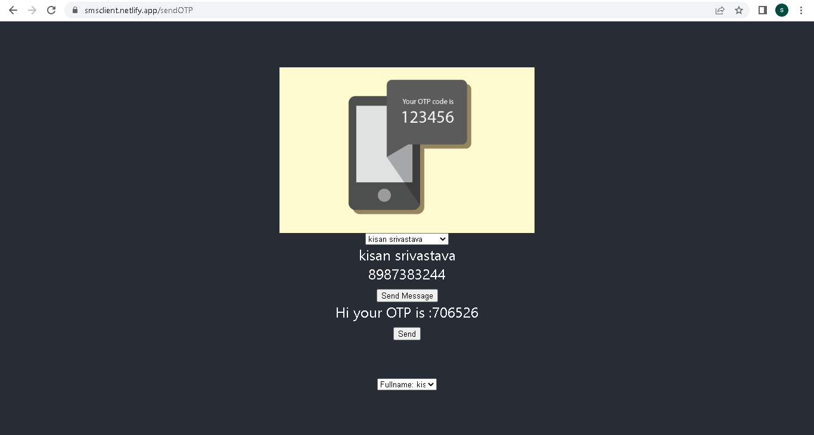

Serviceapi deployment: https://smsserviceapi.herokuapp.com/  
Clientapi deployment:    https://github.com/Lets-coD/smsclient  
Hosted site: 		https://smsclient.netlify.app/  

According to Question:  
1.	Create an account in Fast2Sms and VonageApi  for Testing  
2.	First we have to create  two menu list.  
3.	onChange event of the menu list,we  call the contact info component.  
4.	Upon sendMessage click event we are routed to sendotp component using Route from react router dom  
5.	We pass info and create history function in prop.  
6.	We generate 6 digit random otp.  
7.	We add the details in history.  
8.	We call back our create history function of App.  
9.	We call smsseviceapi using   axios , smsserviceapi is hosted in heroku.  
10.	We push the smsclient code to github and deploy in Netlify.  
